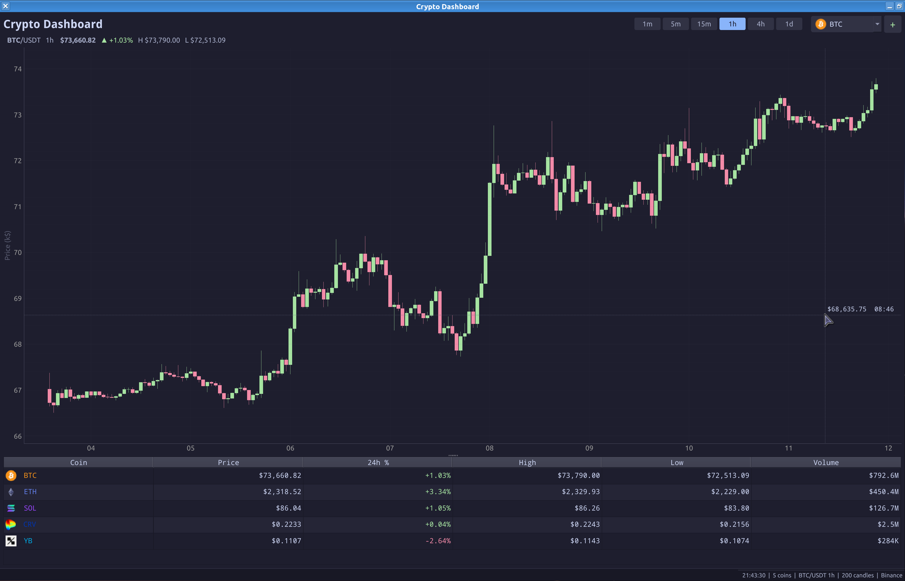

# Crypto Dashboard

Real-time cryptocurrency dashboard built with Python and Qt. Features candlestick charts, live price streaming from Binance, and a dynamic coin watchlist.



## Features

- **Candlestick charts** with OHLC data from Binance, updated in real time
- **Multiple timeframes**: 1m, 5m, 15m, 1h, 4h, 1d
- **Live ticker table** with price, 24h change, high/low, and volume
- **Add/remove coins** dynamically — your watchlist is saved across restarts
- **Crosshair** with price and time readout on hover
- **Dark theme** (Catppuccin Mocha)

## Quick Start

Requires [uv](https://docs.astral.sh/uv/) and a system **PyQt6** (e.g. the
`python-pyqt6` package on most distros):

```sh
./crypto-dashboard
```

The launcher creates a project environment with `--system-site-packages` so the
system PyQt6 is reused, and lets uv manage the remaining pure-Python
dependencies. To set things up manually:

```sh
uv venv --system-site-packages
uv run crypto-dashboard
```

### No system PyQt6?

Pull it from PyPI instead of using the system build:

```sh
uv sync --extra pyqt
uv run crypto-dashboard
```

## Building a Package

```sh
uv build            # wheel + sdist in dist/
```

The version is defined once by `__version__` in `crypto_dashboard.py`.

## Usage

- **Switch coins**: click the dropdown or double-click a table row
- **Change timeframe**: click the interval buttons (1m / 5m / 15m / 1h / 4h / 1d)
- **Add a coin**: click **+** and enter a Binance symbol (e.g. PEPE, SHIB, WIF)
- **Remove a coin**: right-click a table row
- **Zoom/pan**: scroll wheel and drag on the chart; right-click > View All to reset

## Desktop Shortcut (from a source checkout)

```sh
./install-desktop.sh
```

This installs a user-level `.desktop` entry and icon so the app appears in your
application launcher. It's a dev convenience for running from a git clone —
distribution packages install these into system paths instead (see below).

## Packaging for distributions

The project builds as a standard PEP 517 wheel (hatchling backend), so it slots
into deb / rpm / ebuild workflows via each distro's Python macros
(`dh_python3`/`pybuild`, `%pyproject_*`, `distutils-r1` with
`DISTUTILS_USE_PEP517=hatchling`).

**Runtime dependencies** — map these to the distro's own packages (do **not**
vendor them via pip):

| Import            | Typical package name              |
|-------------------|-----------------------------------|
| PyQt6             | `python3-pyqt6` / `dev-python/PyQt6` |
| pyqtgraph         | `python3-pyqtgraph`               |
| numpy             | `python3-numpy`                   |
| requests          | `python3-requests`                |
| websocket-client  | `python3-websocket-client`        |
| platformdirs      | `python3-platformdirs`            |

PyQt6 is intentionally absent from `[project.dependencies]` (it's expected from
the system); declare it as a package dependency in your spec/ebuild/control.

**Data files** — install these from the source tree to standard locations:

| Source                                              | Destination                                              |
|-----------------------------------------------------|----------------------------------------------------------|
| `data/crypto-dashboard.desktop`                     | `/usr/share/applications/`                               |
| `data/icons/hicolor/scalable/apps/crypto-dashboard.svg` | `/usr/share/icons/hicolor/scalable/apps/`            |

The wheel installs the module and a `crypto-dashboard` entry point
(`/usr/bin/crypto-dashboard`). The `uv` launcher script and `install-desktop.sh`
are dev tools and are **not** part of a distribution package.

## Data Sources

All data comes from Binance:
- WebSocket streams for live kline and mini-ticker updates
- REST API for historical candlesticks and 24hr ticker stats
